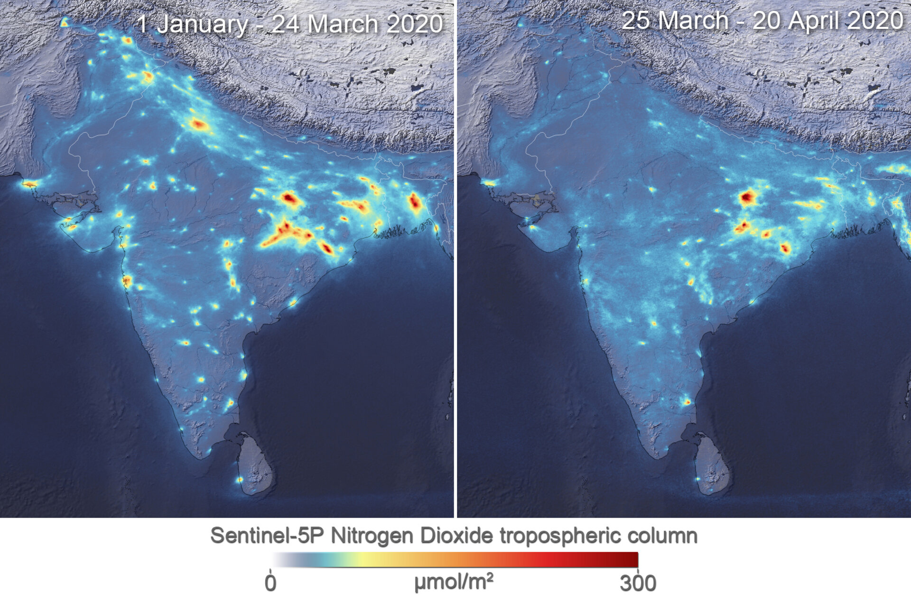

# COVID-19: A Boon for Nature

## Introduction
Air Pollution causes more than seven million deaths per year. In 2018, USA linked to nearly 10,000 additional deaths. More than 3/4 of annual greenhouse gases gets produced by transportation, industry, and power generation resulting in forcing the 90% of the global population to breath in unsafe air. 

The novel COVID-19 virus has left the world reeling with thousands of deaths and lakhs of cases. The entire human life has come to a standstill with the majority of the countries enforcing shutdown/lockdown and travel bans. 

Amidst this chaos, there is an unlikely beneficiary in the form of mother nature. There is a drastic reduction in air pollution
all over the world which has been a major concern over the years.

## About
This positive outcome has inspired me to research more on the datasets available and predict the impact of improved air quality on the overall ecosystem, such as by how far the melting of polar ice will be pushed which was originally predicted at 2100. The positive aspect of this pandemic could be an eye opener to reanalyze the parameters which play a vital role in a healthier environment. This might encourage people to keep the air immaculate once this lockdown is over.

## Clone
* Clone the repository using HTTPS: 
    
    `git clone https://github.com/UtkarshChaurasia/COVID-19-A-boon-for-nature.git`
* Clone the repository using SSH:   
    
    `git@github.com:UtkarshChaurasia/COVID-19-A-boon-for-nature.git`

## Dataset:
Data is collected from following list of sources.
* [World Air Quality Index - WAQI](https://waqi.info/)
* [CityMapper Mobility Index](https://www.data.gouv.fr/en/datasets/citymapper-mobility-index/)
* [Official Airline Guide - OAG](https://www.oag.com/)
* [Federal Reserve System](https://www.federalreserve.gov/data.htm)

## Dependencies
Following dependecies should be availble in the system prior to notebook execution and can be installed by running `pip install <dependency name>`
* `pandas`
* `numpy`
* `matplotlib`
* `seabon`
